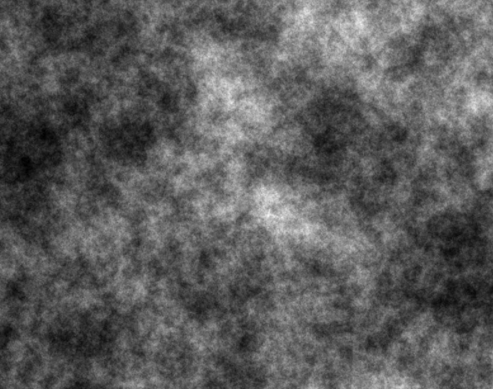
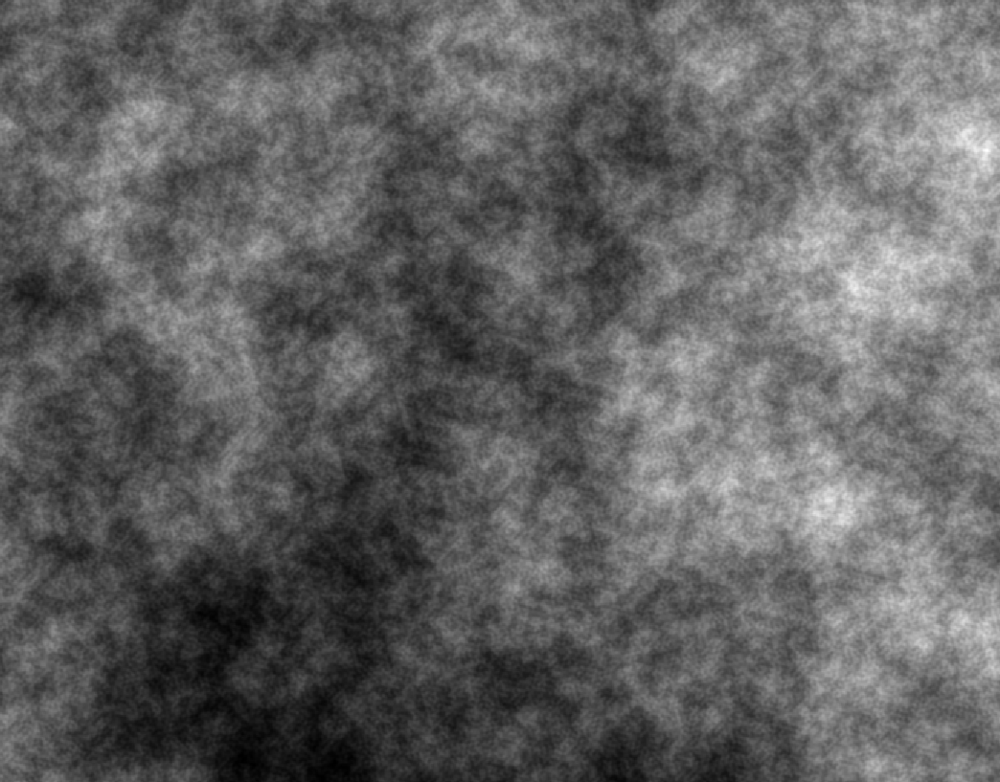

# DynamicNoise


[](https://github.com/ZapolyarnyDev/DynamicNoise/releases)
[](LICENSE)

DynamicNoise is a flexible and lightweight library for procedural generation of 1D, 2D, and 3D noise maps.
Perfect for game developers, visual effects artists, or anyone working with procedural content generation.
Supports popular noise algorithms like Perlin and Simplex, with customizable parameters for finer control over results.

[Latest release here](https://github.com/ZapolyarnyDev/DynamicNoise/releases).


Supported dimensions of the maps:
- 1D
- 2D
- 3D


List of noises:
- Perlin noise
- Simplex noise
- Value noise
- White noise

## Install

#### WARNING
The minimum working version is [1.0.1](https://github.com/ZapolyarnyDev/DynamicNoise/releases). Do not use **1.0.0**, as it contains build errors.

#### Maven

```xml
<dependency>
    <groupId>io.github.zapolyarnydev</groupId>
    <artifactId>dynamicnoise-lib</artifactId>
    <version>VERSION</version>
</dependency>
```

#### Gradle

```groovy
dependencies {
  implementation("io.github.zapolyarnydev:dynamicnoise-lib:VERSION")
}
```

## Example of usage

Let's generate a two-dimensional 500X400 map (All library methods are described in JavaDocs):

### Input parameters:

```java
NoiseMap gameMap = new NoiseMap(new double[500][400]);
Noise noise = new SimplexNoise();
noise.setOctaves(6);
noise.setScale(5);
noise.setLacunarity(3);
noise.setPersistence(1.32);
NoiseGenerator generator = new NoiseGenerator(noise);
generator.generateForMap(gameMap, noise, 0, 1);
double[][] doubles = gameMap.getDoubleArray();
display2DNoise(doubles); // Change to your own rendering method 
```

### Output result:



## License
This project is licensed under the [MIT License](https://github.com/ZapolyarnyDev/DynamicNoise/blob/main/LICENSE).
